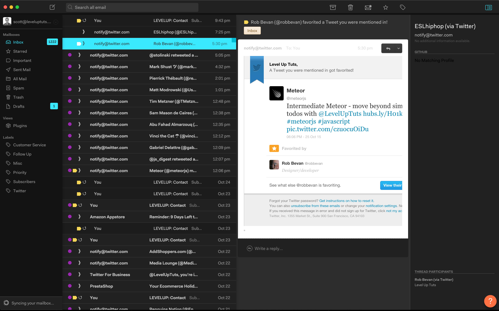
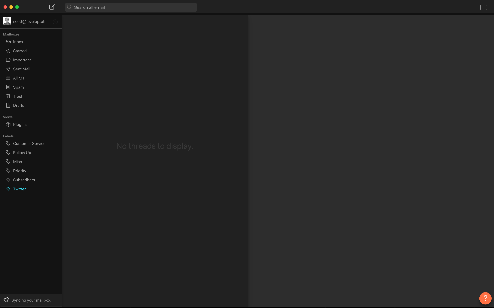

# Level Up - Nylas N1 Theme
### v0.0.1

A theme for the [Nylas N1](https://nylas.com/N1) email client.

## How to use / install

1. Download and extract the repo
2. Open Nylas N1
3. Go to `Edit > Install Theme...`
4. Navigate to the extracted folder, and click `Open` on the selected folder
5. Done!

## If you want to switch back
1. Go to `Edit > Change Theme...`
2. Select the desired theme
3. Done!

### Q & A

Q. Does this work?

> Yes, I'm using it as a daily driver right now

Q. Is it complete?

> Not in the least bit.

Q. I hate the choices you made.

> `¯\_(ツ)_/¯`

Q. Can I see another screenshot?

